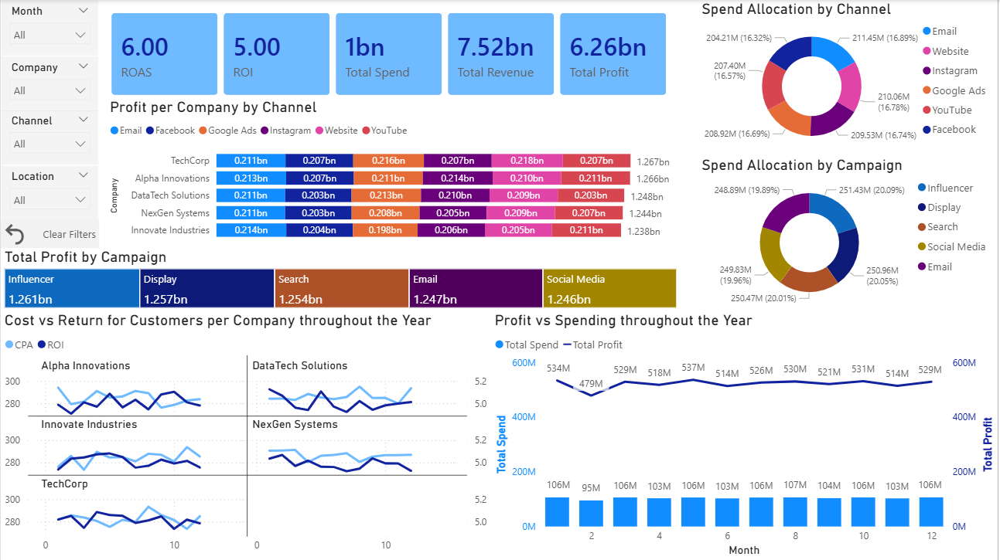
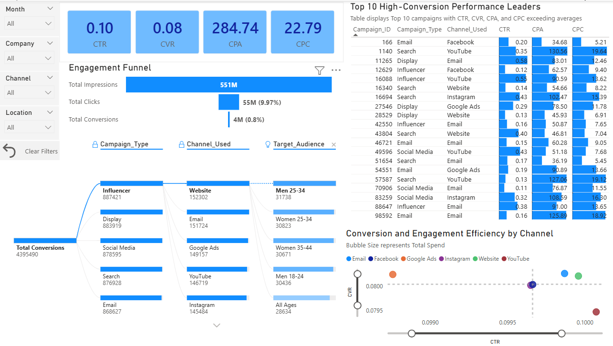
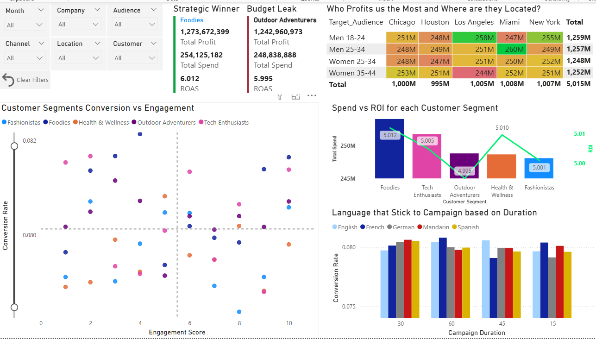
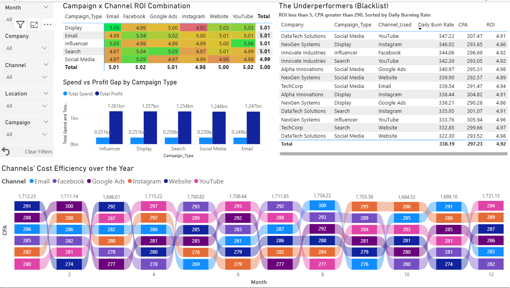

# Marketing Analytics Dashboard

> Analyzing 100,000+ marketing campaigns to identify ROI drivers and optimize budget allocation

[](Marketing_Analytics_Dashboard.pbix)
[](data/)



---

## 💡 Why This Project?

My first portfolio project exploring digital marketing analytics. Built to understand marketing KPIs (ROAS, ROI, CTR, CVR) and demonstrate end-to-end BI skills—from Python data prep to interactive Power BI visualization.

**The Challenge:** Dataset with tight performance variance (5.995-6.012 ROAS) required honest insight framing vs. overstated findings.

---

## 🎯 What It Does

Four strategic tabs analyzing **$7.52B revenue** across **100K+ campaigns**:

### 📊 1. Financials
High-level performance: ROAS 6.00, ROI 5.00, $6.26B profit
*→ Who's spending what and where*

### 🎯 2. Acquisitions
Conversion funnel: 551M impressions → 4M conversions (0.8%)
*→ What's converting and at what cost*

### 👥 3. Audience
Segment profitability across demographics and locations
*→ Who's profitable and where they are*

### ⚡ 4. Efficiency
**284 underperforming campaigns** flagged (ROI <5, CPA >$290)
*→ What to cut immediately*

---

## 📊 Dashboard Highlights

| Tab | Key Insight | Business Value |
|-----|-------------|----------------|
| **Financials** | Channel spend distribution | Reallocate budgets to high-ROI channels |
| **Acquisitions** | Top 10 high-converters identified | Blueprint for campaign replication |
| **Audience** | Geographic × demographic heatmap | Precision targeting opportunities |
| **Efficiency** | 284 campaigns burning $338/day avg | Immediate budget cut candidates |





---

## 🛠️ Technical Stack

**Data:** Kaggle dataset (~100K campaigns) → Python (pandas) → Power BI
**Model:** Star schema with 7 dimension tables
**Visuals:** KPI cards, heatmaps, scatter plots, funnel, ribbon charts
**DAX:** Custom measures for ROAS, ROI, CTR, CVR, CPA, CPC
**Challenge:** Handled 100K Campaign_ID cardinality via aggregation strategy

**Key Optimization:** Excluded high-cardinality fields from visuals; aggregated by Channel, Type, Segment, Location instead.

---

## 🎓 Key Learnings

**Domain:** Marketing KPIs, conversion funnels, budget allocation strategies
**Technical:** Star schema design, DAX measures, cardinality handling, interactive design
**Analytical:** Data honesty (not overstating marginal differences), actionable vs. descriptive insights

**Biggest Surprise:** 100K unique Campaign_IDs forced complete rethink of visualization strategy—learned importance of cardinality awareness in BI.

---

## 🚀 Quick Start

1. Download `Marketing_Analytics_Dashboard.pbix`
2. Open in [Power BI Desktop](https://powerbi.microsoft.com/desktop/) (free)
3. Use slicers to filter by Month, Company, Channel, Location
4. Click "Clear All Filters" to reset

**Adapt for your data:** Replace data source in Power Query, validate column mappings, customize thresholds.

---

## 📁 Project Structure
```
marketing-analytics-dashboard/
├── Marketing_Analytics_Dashboard.pbix    # Dashboard file
├── data/
│   ├── marketing_data.csv                # Raw dataset
│   └── marketing_data_cleaned.csv        # Cleaned dataset
└── screenshots/                          # Dashboard screenshots
```

---

## 💭 Reflections

**What I'd do differently:**
- Start with stakeholder questions before building
- Wireframe dashboard layout upfront
- Add executive summary tab for leadership

**Key takeaway:** The Underperformers Blacklist (Tab 4) provides more actionable value than marginal segment comparisons—focus on what drives decisions.

---

## 📧 Contact

**Youssef Atta** - Data Analyst

📧 [yosofelkhateeb@gmail.com](mailto:yosofelkhateeb@gmail.com)
💼 [LinkedIn](https://linkedin.com/in/youssef-atta)
🌐 [GitHub](https://github.com/yosofelkhateeb)

---

⭐ **Star this repo if you found it useful!**

---
